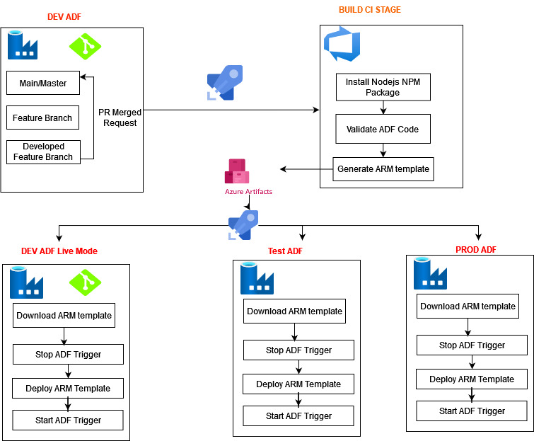

# DataFactory-CI-CD
 Explore this public GitHub repository for a detailed guide on setting up CI/CD for Azure Data Factory. Learn best practices, configuration steps, and deployment pipelines to seamlessly integrate, test, and deploy your data engineering workflows. Boost efficiency in your Data Factory projects with efficient CI/CD practices.

## The Importance of CI/CD for Data Factory

- **Improved User Access Control**: CI/CD pipelines offer granular control over user permissions within Data Factory. Access to critical resources, such as production data lakes and databases, can be restricted, reducing the risk of unauthorized data manipulation or exposure.
- **Reduced Security Risks**: With CI/CD pipelines, users do not require direct access to production data lakes, databases, and other sensitive resources. This minimizes the attack surface and mitigates potential security risks associated with unauthorized access or accidental data modification.
- **Code Review and Approval**: CI/CD promotes collaboration and ensures changes adhere to best practices through structured code review and approval processes.
- **Versioning and Rollbacks**: CI/CD enables tracking and easy rollbacks to previous working states, minimizing the impact of errors or unintended consequences.
- **Automated Testing**: CI/CD integrates automated testing processes to validate pipeline configurations and maintain data quality and reliability.

By implementing CI/CD practices, Data Factory can enhance security, maintain data integrity, and streamline the development process.


## Streamlined CI/CD Approach: Automating Software Delivery


## Before commencing this tutorial, it is important to establish the following assumptions:

- Two ADF Workspaces, namely Dev and Prod, have already been deployed.
- Two Data Lakes, Dev and Prod, are available.
- Please note that in this scenario, we are considering two ADF instances. However, in real-world scenarios, a testing ADF may also be present.
- The Dev ADF is configured with a linked service to the Dev Data Lake, while the Prod ADF is configured with a linked service to the Prod Data Lake.

These assumptions will serve as a foundation for the tutorial, ensuring that the subsequent steps and explanations align with the specified environment.

``` It is important to note that only the Dev ADF will be integrated with Git, while the remaining ADF instances such as Prod and Test will not be GIT integrated.```


